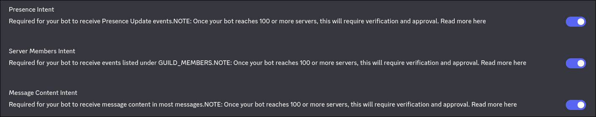

# 🚩 Root-Me Discord Notification Bot

A Discord bot written in **Go** that monitors a list of Root-Me users and sends notifications when they solve a challenge.

## 🛠️ Requirements

* **Go** (1.20 or higher)
* A Discord Developer Account
* A Root-Me API Key (in your account parameter)

---

## ⚙️ Discord App Configuration

### 1. Bot Privileged Intents
To function correctly, the bot requires specific gateway intents. In the [Discord Developer Portal](https://discord.com/developers/applications), navigate to the **Bot** tab and enable the following:
* Presence Intent
* Server Members Intent
* Message Content Intent



### 2. OAuth2 URL Generator
To invite the bot to your server, go to **OAuth2 -> URL Generator** and select:
* `bot`
* `applications.commands`

### 3. Bot Permissions
Assign these permissions to the bot to allow it to communicate:
* Send Messages
* Embed Links
* Read Message History

---

## 📥 Installation & Setup

1. **Clone the repository**:
```bash
   git clone https://github.com/ZdarkBlackShadow/root-me-discord-bot.git
```

2. **Install Dependencies**

```bash
    go mod tidy
```

3. **Configure Environment Variables**

Rename `.env.example` to . `env` in the root directory and configure your Environment Variables

```bash
    mv .env.example .env
```

4. **Add Users**

Edit `users.json` to include the members you want to track

```json
[
  {
    "discord_name": "ZdarkBlackShadow",
    "rootme_id": 1052350
  }
]
```

5. **Running the bot**

```bash
    go run main.go
```

## 🛠️ Build

### Local Build

To create an executable:
```bash
    go build -o root-me-bot main.go
```

## Message Example

